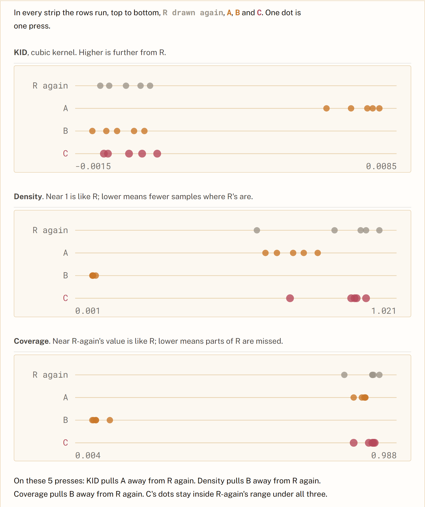

# Process overview

## Motivation

SLOP8412, *Advanced Fréchet Inception Distance*: a twelve-week course that
audits one number, on a bench of a reference and three candidates in 2048 dimensions, re-scored every week with that week's method.

I chose the topic for the brief's constraint, narrow enough that no real
university would run it. FID has three layers, the mathematics, an
implementation and a use in computer vision, so difficulty rises in that order
and the concepts stay related. Level 8 because it assumes probability and code.
Every score on the bench having a closed form is what let me tell whether the
agent's output was true.

A good course, I decided, is one idea carried all the way. Assignment 1 lost most on response, the idea in my head and not on the page,
so the harness came first.

## Guidelines

Three rules went into `CLAUDE.md` before any content:
argue instead of setting a mood, earn anything symbolic or cut it, and make
non-adjacent weeks need each other ([`3dde85d`](https://github.com/comp4020-agentic-coding-studio/comp4020-ass2-jnheinrich451-eng/commit/3dde85d)). Later the course team's advice became one sentence at its top that every page
is judged against ([`ca3e465`](https://github.com/comp4020-agentic-coding-studio/comp4020-ass2-jnheinrich451-eng/commit/ca3e465)).

A rule I kept re-applying by hand became a check. A coined term never appears
before the week that coins it ([`390f6be`](https://github.com/comp4020-agentic-coding-studio/comp4020-ass2-jnheinrich451-eng/commit/390f6be)); a course-wide rule is stated once
and linked everywhere else ([`0c29cbd`](https://github.com/comp4020-agentic-coding-studio/comp4020-ass2-jnheinrich451-eng/commit/0c29cbd)); a lecture marked ready carries a deck
or an instrument ([`df3ef05`](https://github.com/comp4020-agentic-coding-studio/comp4020-ass2-jnheinrich451-eng/commit/df3ef05)); every week names its measurement-log entry
([`7772ffa`](https://github.com/comp4020-agentic-coding-studio/comp4020-ass2-jnheinrich451-eng/commit/7772ffa)).

Some things I left out on purpose. Rule 1 has no check: whether a paragraph
argues or sets a mood is judgement, and a test for it would pass mood, so I read
against it myself. Week 12 has no instrument, because its work is the defence.

I read the spec for what it allows as well as what it requires, and checked each
edge before crossing it. The platform is fixed, so its one divergence is a
gated variable that CI never sets ([`901d147`](https://github.com/comp4020-agentic-coding-studio/comp4020-ass2-jnheinrich451-eng/commit/901d147)). The spec asks for one real deck; three more lectures carry an instrument
instead, labelled so none promises slides.

## How I got here

My anchor was week 5: I read three papers and wrote that page myself, and
everything else was written against it ([`c942868`](https://github.com/comp4020-agentic-coding-studio/comp4020-ass2-jnheinrich451-eng/commit/c942868)).

The build was plain, and I would rather say so than dress it up. It was a loop
in stages: an idea, then a paragraph or a picture, then I checked the design
and accepted it or pushed back. I directed by prompt, by instruction file and
by looking at the render.

Most bugs were one bug: a check that could not fail. A coherence test read a
field the API does not carry ([`224688b`](https://github.com/comp4020-agentic-coding-studio/comp4020-ass2-jnheinrich451-eng/commit/224688b)); I found clipped slides by eye before any test did ([`1fc21a1`](https://github.com/comp4020-agentic-coding-studio/comp4020-ass2-jnheinrich451-eng/commit/1fc21a1)). A number teaches nothing by itself,
so the second half let a student reach it alone, in labs and instruments that
run in the page ([`30f9e85`](https://github.com/comp4020-agentic-coding-studio/comp4020-ass2-jnheinrich451-eng/commit/30f9e85)). That added a step: measure first, then build.
Week 7 claimed two newer scores catch what FID misses; measured, neither does,
and the argument changed to the true one ([`2b2ffc2`](https://github.com/comp4020-agentic-coding-studio/comp4020-ass2-jnheinrich451-eng/commit/2b2ffc2)).

The worst failure was the same bug one level up. Every check ran on my working
tree, which held uncommitted files, so eight commits went out green while HEAD
could not build. The repair was at the harness level: a check that reads the
git index, and a rule that a check proves the tree it ran on ([`dbad4d6`](https://github.com/comp4020-agentic-coding-studio/comp4020-ass2-jnheinrich451-eng/commit/dbad4d6)).

No single step was hard. The work was keeping my instructions, the site and the
checks in agreement, and that is mostly what the commit history shows.
