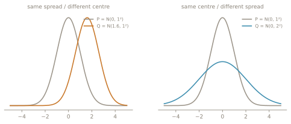
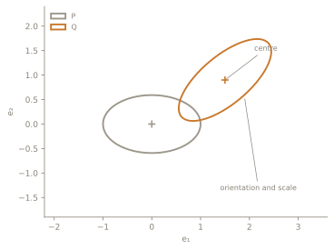
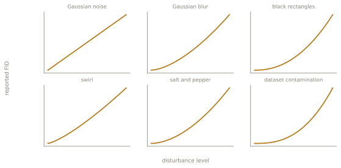

import Eq from "../components/Eq.astro";
import DeckExit from "../components/DeckExit.astro";

<DeckExit back="/lectures/week-02/" label="Week 02" />

<style>{`:root { --deck-footer: "SLOP8412 · LECTURE 02 · THE DISTANCE"; }`}</style>

{/* _class: impact */}

# Two Gaussians, one number.

Where FID gets its mathematics, before we ask whether it deserves our trust.

```notes
- sixteen slides, one derivation, then one hinge
- say the shape out loud: we want a distance between distributions, transport
  gives the right question, the general problem is hard, Gaussians are
  cooperative, and the closed form is only mean and covariance
- everything after that is the instrument, not the mathematics
```

---

## The number we are trying to explain

<Eq name="fid" alt="FID equals the squared distance between the two means, plus the trace of sigma-r plus sigma-g minus twice the matrix square root of sigma-r-half sigma-g sigma-r-half." size="wide" />

<div class="split">
  <div>
    <p class="label">Location</p>
    <Eq name="fid-location" alt="Squared norm of mu-r minus mu-g." />
  </div>
  <div>
    <p class="label">Shape</p>
    <Eq name="fid-shape" alt="Trace of sigma-r plus sigma-g minus twice the matrix square root term." />
  </div>
</div>

By the end of this lecture every symbol here should have a reason to be here.

```notes
- give them the destination before the derivation; nobody follows a derivation
  toward an unknown
- do not explain the trace term yet, only name the two halves
```

---

## FID does not compare images

<div class="split">
  <div>
    <p class="label">No canonical pair</p>
    <p class="crossed">real image &times; generated image</p>
    <p>Nothing says which generated image answers which real one.</p>
  </div>
  <div>
    <p class="label">What we have instead</p>
    <p>Two sets, and a question about the sets.</p>
    <p class="mono">P &nbsp;&harr;&nbsp; Q</p>
  </div>
</div>

**We need a distance between distributions, not a matching between individual
samples.**

```notes
- ask for a definition before showing one; the wrong answers are the useful
  part, because most of them pair samples
- a generative model is judged by the distribution it produces, not by whether
  one output corresponds to one particular real image
```

---

## Same marginals. Different couplings.


<Eq name="marginals" alt="X drawn from P, Y drawn from Q." />

P and Q say where X and Y live. They do not say how to pair them.

```notes
- costs are 6 for independent, 8 for counter-monotone, 4 for the monotone one
- all three panels have identical marginals; only the pairing changes
- this is the only slide that uses the full three-panel visual
```

---

{/* _class: centered */}

## Wasserstein as a search

<Eq name="w2-def" alt="W-2 squared of P and Q is the infimum over couplings pi in Pi of P and Q of the expected squared distance between X and Y." size="wide" />

<div class="annot">
  <p><span class="mono">&Pi;(P, Q)</span> every joint distribution with marginals P and Q</p>
  <p><span class="mono">&#8214;X &minus; Y&#8214;&sup2;</span> the transport cost</p>
  <p><span class="mono">inf</span> choose the cheapest admissible coupling</p>
</div>

```notes
- read it as a search, not as a formula
- Wasserstein asks for the cheapest way to make P and Q coexist
```

---

## Why this is hard

<div class="split">
  <div>
    <p class="label">General distributions</p>
    <Eq name="coupling-object" alt="Pi of x and y." />
    <p>An entire joint density.</p>
    <p class="verdict">Infinite-dimensional optimisation.</p>
  </div>
  <div>
    <p class="label">Gaussians</p>
    <Eq name="gaussian-params" alt="Mu-P and Sigma-P, mu-Q and Sigma-Q." />
    <p>Four objects, all finite.</p>
    <p class="verdict verdict--good">Finite-dimensional structure.</p>
  </div>
</div>

**This lecture works because Gaussians are unusually cooperative.**

```notes
- do NOT say we approximate Wasserstein by restricting to jointly Gaussian
  couplings. For Gaussian marginals the problem admits the affine structure
  that yields the closed form
- the approximation enters later, when arbitrary Inception features are
  represented by fitted Gaussian moments
```

---

## Start in one dimension

<Eq name="oneD-setup" alt="P is normal with mean mu-P and variance sigma-P squared; Q likewise." />

<p class="fragment">Couple them through <em>the same</em> standard normal:</p>

<div class="fragment"><Eq name="oneD-coupling" alt="X equals mu-P plus sigma-P Z; Y equals mu-Q plus sigma-Q Z." /></div>

<div class="fragment"><Eq name="oneD-diff" alt="X minus Y equals mu-P minus mu-Q, plus sigma-P minus sigma-Q times Z." /></div>

<div class="fragment boxed"><Eq name="oneD-result" alt="W-2 squared equals mu-P minus mu-Q squared plus sigma-P minus sigma-Q squared." size="wide" /></div>

```notes
- the same Z is the whole trick; point at it
- using E[Z] = 0 and E[Z squared] = 1
- in one dimension Wasserstein separates where the distributions are from how
  wide they are
```

---

## Two things are being measured



<div class="split">
  <div><Eq name="term-location" alt="Mu-P minus mu-Q, squared." /><p class="label">mean mismatch is location</p></div>
  <div><Eq name="term-spread" alt="Sigma-P minus sigma-Q, squared." /><p class="label">variance mismatch is spread</p></div>
</div>

```notes
- neither panel is more wrong than the other in any way the number expresses
- that is a feature here and a problem in week 6
```

---

## Now go to d dimensions



<Eq name="dD-setup" alt="P is normal with mean mu-P and covariance Sigma-P; Q likewise." />

In multiple dimensions, spread is no longer one number. It is scale,
orientation and correlation at once.

```notes
- point at the tilt: that is correlation, and no scalar variance can carry it
- this is why the closed form needs a matrix square root rather than a
  difference of standard deviations
```

---

## The derivation board

<Eq name="row-setup" alt="U equals X minus mu-P; V equals Y minus mu-Q." />

<div class="board">
  <div class="fragment"><Eq name="row-1" alt="X minus Y equals delta mu plus U minus V." /></div>
  <div class="fragment"><Eq name="row-2" alt="Expected squared norm of X minus Y equals squared norm of delta mu plus expected squared norm of U minus V." /></div>
  <div class="fragment"><Eq name="row-3" alt="Equals squared norm of delta mu plus trace of Sigma-P plus Sigma-Q minus C minus C transpose, where C is the cross-covariance." /></div>
  <div class="fragment"><Eq name="row-4" alt="Equals squared norm of delta mu plus trace of Sigma-P plus Sigma-Q, minus twice the trace of C." /></div>
</div>

<p class="fragment verdict">Everything is known except the cross-covariance C.</p>

```notes
- reveal one row at a time; do not advance until the previous row is read back
- the whole reduction is four lines and it belongs on one slide
```

---

## The problem has collapsed

<div class="split">
  <div>
    <p class="label">Joint covariance</p>
    <div class="matrix" role="img" aria-label="The joint covariance of X and Y is a two by two block matrix: Sigma-P and C on the top row, C transpose and Sigma-Q on the bottom row.">
      <span class="bracket">[</span>
      <span class="cells">
        <span>&Sigma;<sub>P</sub></span><span>C</span>
        <span>C<sup>&#8868;</sup></span><span>&Sigma;<sub>Q</sub></span>
      </span>
      <span class="bracket">]</span>
      <span class="psd">&#8829; 0</span>
    </div>
    <p>The block must stay positive semi-definite.</p>
  </div>
  <div>
    <p class="label">What is left to do</p>
    <ol class="chain">
      <li>minimise cost</li>
      <li>maximise Tr(C)</li>
      <li>subject to a valid joint covariance</li>
    </ol>
  </div>
</div>

The infinite-dimensional coupling problem is now a structured matrix problem.

```notes
- this is the slide where the search becomes finite
- the constraint is the whole difficulty: C cannot be chosen freely
```

---

{/* _class: centered */}

## The Gaussian solution

<Eq name="max-trace" alt="The maximum over C of the trace of C equals the trace of the matrix square root of Sigma-P-half Sigma-Q Sigma-P-half." size="wide" />

<div class="boxed"><Eq name="w2-gaussian" alt="W-2 squared of P and Q equals the squared distance between the means plus the trace of Sigma-P plus Sigma-Q minus twice the symmetric matrix square root term." size="wide" /></div>

<p class="small">Sanity check, in one dimension or whenever the covariances commute, the covariance term collapses: <Eq name="sanity-1d" alt="Tends to sigma-P minus sigma-Q squared." inline /></p>

```notes
- the matrix expression is the multidimensional version of centre plus spread
- prefer the symmetric form; the unqualified product form is not symmetric and
  a numerical routine will notice in week 4
```

---

## FID adds an instrument

<div class="pipeline" role="img" aria-label="Real images and generated images each pass through Inception-v3 to feature vectors, then to a mean and covariance. The two pairs of moments meet in the Gaussian Wasserstein-2 distance, whose output is FID.">
  <div class="rail">
    <span>real images</span><span>Inception-v3</span><span>features</span><span class="gold">&mu;<sub>r</sub>, &Sigma;<sub>r</sub></span>
  </div>
  <div class="join"><span>Gaussian W&#8322; &rarr; <strong>FID</strong></span></div>
  <div class="rail">
    <span>generated images</span><span>Inception-v3</span><span>features</span><span class="gold">&mu;<sub>g</sub>, &Sigma;<sub>g</sub></span>
  </div>
</div>

**The Gaussian distance is the mathematics. Everything before it is a
measurement decision.**

```notes
- this is the conceptual hinge of the whole course
- Inception is an ImageNet-trained representation, and the moments retain only
  the first two
- Heusel and colleagues introduce FID exactly this way: images through
  Inception, coding layer, fit mean and covariance, assume a multivariate
  Gaussian, compute the Fréchet distance
```

---

## Why people believed the number

**Worse images, larger FID.**



In the original experiments the score rose monotonically as each of these
disturbances grew stronger.

```notes
- source: Heusel et al. 2017, Figure 3 and the discussion around it
- the curves here are redrawn schematics, not their measured values; say so if
  anyone asks what the axis units are
- this is real evidence, and it is a much weaker claim than "ranks models the
  way people do". Week 10 is where that distinction gets paid for
```

---

## Four assumptions enter the number

<div class="assumptions">
  <div><p class="label">1 · Representation</p><p>Inception-v3 decides which visual differences are visible at all.</p><p class="mono">&rarr; week 03</p></div>
  <div><p class="label">2 · Compression</p><p>A high-dimensional feature distribution becomes a mean and a covariance.</p><p class="mono">&rarr; week 03 / 07</p></div>
  <div><p class="label">3 · Gaussianisation</p><p>Only the first two moments survive the fit.</p><p class="mono">&rarr; week 07</p></div>
  <div><p class="label">4 · Estimation</p><p>Finite samples estimate those moments.</p><p class="mono">&rarr; week 05</p></div>
</div>

The formula is exact for Gaussians. FID is an engineered pipeline built around
that formula.

```notes
- these four are the semester's audit list; every later week attacks one of them
- do not defend or attack them here, only name them
```

---

## Which model is closer?

Reference R, candidates A and B, scored by the closed form rather than by
sampling.

<div class="split">
  <div><Eq name="bench-a" alt="W-2 squared of R and A equals 5.12." /></div>
  <div><Eq name="bench-b" alt="W-2 squared of R and B is approximately 4.88." /></div>
</div>

**B wins.** We will spend the rest of the course asking whether that ranking
survives the measurement pipeline.

```notes
- one worked example only; the arithmetic is on the session page
- this is the number week 5 takes apart
```

---

{/* _class: centered */}

## The distance is clean. The instrument is not.

<div class="split">
  <div>
    <p class="label">Mathematics</p>
    <p>A closed form. Geometrically meaningful. Exact for Gaussians.</p>
  </div>
  <div>
    <p class="label">Instrument</p>
    <p class="mono small">
      images &rarr; preprocessing &rarr; encoder &rarr; finite sample &rarr;
      estimated moments &rarr; Gaussian fit &rarr; one scalar
    </p>
  </div>
</div>

Next: what exactly is Inception measuring?

```notes
- two teasers, no more. Finite-sample FID is biased and the bias depends on the
  generator, so fixing N does not remove it (Chong and Forsyth; week 5 owns it)
- and low-level preprocessing such as resizing and compression can move
  Inception activations enough to move the score (Parmar and colleagues; the
  implementation week owns it)
- close on the next lecture's question, not on a summary
```
