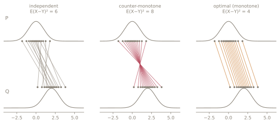
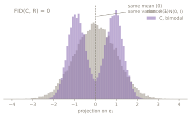
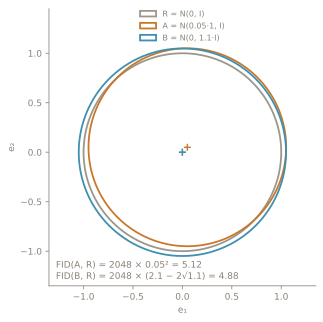
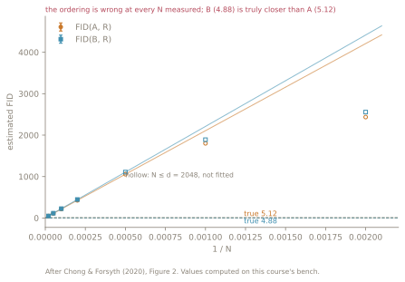

<style>{`:root { --deck-footer: "SLOP8412 · Week 02 · The Fréchet distance"; }`}</style>

{/* _class: impact */}

# Two Gaussians. One number.

```notes
- twelve slides, one step each; say that before starting
- the page carries the same argument, but a page cannot make them wait
  between the steps, and waiting is the point of doing it here
```

---

## What we want

A distance between **distributions**, not between samples.

```notes
- nothing pairs a generated image with a particular real one, so the quantity
  has to be defined on the distributions themselves
- ask the room for a definition before showing one; the wrong answers are the
  useful part, because most of them pair samples
```

---

{/* _class: centered */}

## W₂²(P, Q) = inf 𝔼‖X − Y‖²

over every joint distribution of (X, Y) with marginals P and Q



```notes
- the infimum is over couplings, and a coupling is any joint distribution with
  those two marginals
- all three panels have identical marginals; only the pairing changes
- costs are 6, 8 and 4; the monotone one attains W₂² = 4 = (μ₁ − μ₂)²
- this figure is generated by figures/couplings.py and prints its own numbers
```

---

## Why that is hard

Π(P, Q) is infinite dimensional.


```notes
- there is no formula to evaluate; in general you solve a transport problem
- the three panels on the previous slide are three points in that space, and
  the infimum ranges over all of it
- so a closed form is not a convenience here, it is the difference between a
  metric anyone can compute and one nobody does
```

---

## The move

Take P and Q Gaussian. Restrict the coupling to be jointly Gaussian.



```notes
- linger here; this is the only step in the derivation that costs anything
- everything after it is algebra that would hold for any pair of distributions
- what it buys: the objective now depends only on the two means and the
  cross-covariance, so the search collapses to one matrix
- what it costs is on the slide: these two distributions have the same mean
  and the same variance, so the closed form scores them identically at 0
- week 6 is built on that candidate; plant it now, do not explain it
```

---

{/* _class: centered */}

## ‖μ₁ − μ₂‖²

<p class="fragment">𝔼‖X − Y‖² splits into a mean part and a centred part.</p>

<p class="fragment">The mean part is fixed by the marginals alone. No coupling can improve it.</p>

```notes
- reveal the two lines only after they have looked at the term
- this is the half of the score that has nothing to do with shape
```

---

{/* _class: centered */}

## Tr(Σ₁ + Σ₂ − 2(Σ₁Σ₂)<sup>½</sup>)

<p class="fragment">The centred part touches the coupling only through the cross-covariance.</p>

<p class="fragment">Optimising over that one matrix leaves this.</p>

```notes
- the whole optimisation has collapsed into a matrix square root
- flag the cost early: this is the term that makes the score expensive, and
  week 4 is where that bill arrives
```

---

## The cross term, twice

<p class="fragment">(Σ₁Σ₂)<sup>½</sup> in the papers.</p>

<p class="fragment">(Σ₁<sup>½</sup> Σ₂ Σ₁<sup>½</sup>)<sup>½</sup> in careful implementations.</p>

<p class="fragment">Different matrices. Equal trace. One is symmetric.</p>

```notes
- ask which one they would implement, then ask why it matters, before the
  third fragment
- symmetric means eigvalsh applies and no imaginary parts appear to be thrown
  away, which is exactly the bug week 4 goes looking for
```

---

{/* _class: quote */}

> d² = ‖μ₁ − μ₂‖² + Tr(Σ₁ + Σ₂ − 2(Σ₁Σ₂)<sup>½</sup>)

```notes
- Dowson and Landau, 1982, for multivariate normals
- Heusel and colleagues cite it rather than derive it; the metric is a section
  of that paper, not its subject
- this is the last slide with no numbers in it
```

---

## The bench: A



<p class="fragment">2048 × 0.05² = <strong>5.12</strong></p>

```notes
- A = N(0.05·1, I) against R = N(0, I)
- same covariance, so the trace term is Tr(2I − 2I) = 0 and only the mean term
  survives
- point at the ellipses: per coordinate the difference is 0.0025, invisible.
  The score is 2048 of them added up
```

---

## The bench: B


<p class="fragment">2048 × (2.1 − 2√1.1) = <strong>4.88</strong></p>

```notes
- B = N(0, 1.1·I); same mean, so this time the first term is the one that
  vanishes
- 4.88 is below 5.12, so B is the better candidate, by about a quarter of a
  point out of five
- that margin is the thing week 5 destroys; do not say so yet
```

---

{/* _class: centered */}

## Every number you compute is above these two.



Week 5 says why.

```notes
- do not explain the figure; let them read the gap
- the estimates sit above the dashed true values at every N, and the two
  series are not parallel
- the only claim to make now is that the ordering they just derived is not
  the ordering a finite sample reports
- figures/fid-vs-invN.py prints the crossing, or prints that there is none
```
